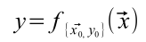

# 从函数的角度看待深度学习

下面是一个公式，为了方便将它命名为公式（1）。

> 这里 markdown 编辑器没办法打出公式中的箭头和右下角的下标0，所以下面的文字说明没办法严格表示出公式里面的符号，我尽量用语言来描述。

据我所知，深度学习系统的运作过程是将输入向量 x 经过某些数学计算得到 y 。为了得到理想的运算结果需要给出训练集 {x0,y0} （公式（1）的{}里面的东西），函数 f 将利用这个训练集来计算 x 到 y 的映射。

结合一个深度学习的过程来说，向量 x 就是模型的输入，y 就是模型的输出（当然，拥有多个输出的深度学习模型输出的不是一个数，而是多个数，这种情况用向量 y 来描述更合适，为了方便这里不严格区分 y 是一个数还是一个向量）。公式（1）里面的 f 函数就是这个模型，集合 {x0,y0} 就是训练用的训练集。

显然 f 本质上就是利用一个依据 {x0,y0} 作为参数的神秘的算法来计算向量 x 到 y 的映射的。

那么，f 里面的算法是怎样的呢？目前深度学习模型针对不同问题有不同的结构，那么结合公式（1）来看，f 就是针对不同问题有不同的算法了吗？如果当今各种深度学习模型抛开细节的差异不谈，在整体上可以用公式（1）去概括的话，是不是应该存在与公式（1）兼容的一个理论去统一整个深度学习领域的算法了呢？